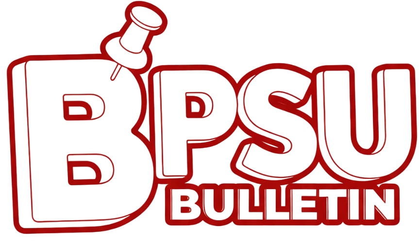

<p align="center">
  
</p>

<h1 align="center">BPSU Bulletin</h1>

<p align="center">
  BPSU Bulletin is a dynamic web application designed as a modern content and announcement platform for Bataan Peninsula State University (BPSU).
</p>

<p align="center">
  
  
  
  
</p>

## ✨ Features

- **User Authentication**: Secure registration and login system, including social login with Google.
- **Content Creation**: A rich text editor (Tiptap) for creating and editing blog posts.
- **Post Management**: Functionality to publish, schedule, draft, and archive posts.
- **Interaction**: Users can react to and comment on posts.
- **Categorization**: Organize posts into various categories and sub-categories (e.g., Achievements, Announcements, Enrollment).
- **User Profiles**: View and edit user profiles and track user activity.
- **Moderation**: A comprehensive suite of tools for administrators to ban users, blogs, and comments, and manage reports.
- **Notifications**: Keep users informed about relevant activities.
- **Search**: Full-text search functionality to easily find content.
- **User Settings**: Manage account preferences, deactivate, or delete accounts.

## 🛠️ Tech Stack

- **Backend**: PHP (Custom MVC-like framework)
- **Frontend**: Tailwind CSS
- **Database**: MySQL
- **PHP Dependencies**:
  - `google/apiclient`: For Google OAuth 2.0 integration.
  - `ueberdosis/tiptap-php`: Server-side handling for the Tiptap rich text editor.
  - `cloudinary/cloudinary_php`: For cloud-based image management.
  - `phpmailer/phpmailer`: For sending emails (e.g., notifications, password resets).
  - `nesbot/carbon`: For easier date and time manipulation.
- **Node.js Dependencies**:
  - `tailwindcss`: A utility-first CSS framework for styling.
  - `prettier`: For code formatting.

---

## 🚀 Prerequisites

Before you begin, ensure you have the following installed on your system:

- [PHP](https://www.php.net/downloads.php) (version 8.0 or higher recommended)
- [Composer](https://getcomposer.org/download/)
- [Node.js and npm](https://nodejs.org/en/download/)
- A MySQL database server (e.g., MySQL Community Server)

> **⚠️ Important Note on Development Environment:**
> This project is configured to run with PHP's built-in web server. Using XAMPP or similar environments may cause issues with routing and file paths. It is **strongly recommended** to follow the setup instructions below.

---

## ⚙️ Installation and Setup

1.  **Clone the Repository**

    ```bash
    git clone https://github.com/WindWalker01/BPSU-Bulletin.git
    cd BPSU-Bulletin
    ```

2.  **Install PHP Dependencies**

    ```bash
    composer install
    ```

3.  **Install Node.js Dependencies**

    ```bash
    npm install
    ```

4.  **Set Up Configuration File**
    Create a copy of the template configuration file and name it `config.php`.

    ```bash
    # For Windows (Command Prompt)
    copy config\config.template.php config\config.php

    # For Windows (PowerShell)
    cp config\config.template.php config\config.php

    # For macOS/Linux
    cp config/config.template.php config/config.php
    ```

5.  **Configure Your Environment**
    Open `config/config.php` and fill in the required credentials for your local environment:
    - Database connection details (`host`, `port`, `dbname`, `user`, `password`)
    - Google API credentials (`client_id`, `client_secret`, `redirect_uris`)
    - Cloudinary credentials (`cloud_name`, `api_key`, `api_secret`)
    - Email application password for PHPMailer.

6.  **Set Up the Database**
    - Create a new MySQL database with the name you specified in `config.php` (default is `bulletin`).
    - Import the database schema from `public/bulletin.sql`. You can use a tool like MySQL Workbench, DBeaver, or the command line.
    ```bash
    # Example using mysql command line
    mysql -u your_username -p your_database_name < public/bulletin.sql
    ```

---

## ▶️ Running the Application

To run the application, you need to start both the PHP server and the Tailwind CSS compiler. It's best to run them in two separate terminal windows.

1.  **Start the PHP Development Server**
    This command will start a local server, typically at `http://localhost:8069`.

    ```bash
    composer run dev
    ```

2.  **Start the Tailwind CSS Watcher**
    This command will watch for changes in your CSS and template files and automatically rebuild your `tailwind.css` file.

    ```bash
    npm run dev
    ```

3.  **Access the Application**
    Once both processes are running, you can access the application in your web browser at:
    [http://localhost:8069](http://localhost:8069)

---

## 🧑‍💻 Development Team

This project was developed by a dedicated team of students from the Bachelor of Science in Computer Science program (SD3A) at Bataan Peninsula State University.

- **Ruzzel P. Mendoza**: Project Leader / Backend Developer
- **Eunil Carl L. Dela Cruz**: UI/UX / Frontend Developer
- **Nathaniel D. Sto Niño**: System Integrator / Assistant Developer
- **Tricia Lei B. Alburo**: QA Tester / Documentation Specialist
